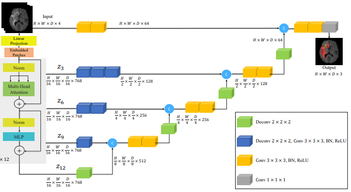

# 3D Vision Transformer for Brain Tumor MRI Segmentation <br>(UNETR implementation in PyTorch)
<p float="left">
    
     
    
</p

*A GIF of an example of a predicted segmentation from the test-set*

This repository contains a Pytorch implementation of a 3D Vision Transformer, by adapting a 2D ViT I implemented in an earlier project (see github projects). The architecture is based on UNETR, and uses skip connections to process multi-scale information

The 3D ViT was then used to effectively perform brain tumor segmentation on MRIs from the BraTS2020 dataset, utilizing full-resolution 3D MRIs.

## The Architecture: 3D ViT (UneTR)
A traditional Vision Transformer works by cutting the original image in patches (eg. 8x8), generating a learned embedding for each patch, adding a positional embedding to each patch embedding, and then using several transformer layers as described in *"Attention Is All You Need"*

A 3D Vision Transformer uses 3D patches (eg 8x8x8), instead of 2D patches. In the UnetR architecture, skip connections, with attached feature extraction blocks, are connected between parts of the encoder and decoder in a "U" like fashion. This allows the model to process multi-scale information and combats the loss of finer detail as the network deepens.

My Pytorch implementation of a UNETR-like 3D Vision Transformer can be found in ```models/vit.py```



*Visualization of the UNETR architecture, sourced from the UnetR paper by Hatamizadeh et al*

## Tumor Segmentation task: BraTS2020
The BraTS2020 is a dataset focusing on the segmentation of brain tumors using MRIs. There are a total of 369 labelled images with a resolution of 240x240x155. Each image has 4 different MRI channels: T1, T1Gd, T3 and FLAIR. The tumors are labelled using 3 different labels: non-enhancing tumor core (1), the peritumoral edema (2), and GD-enhancing tumor (4).

I trained my implemented 3D ViT on 80% of the training data, keeping 20% as validation data. I used a patch size of 32x32x32, an embedding size of 256, 8 transformer layers, and an input resolution of 192x192x128 by randomly cropping the original image. The script used to train this model can be found in ```train.py```

After 70 epochs, the trained model achieved a mean DICE score of 0.704 on the validation set.


*Slices of an example prediction segmentation from the test-set, compared with the ground truth. Green is the label for the non-enhancing tumor core, blue for the peritumoral edema, and red for GD-enhancing tumor*

The GIF at the top of the page is also a predicted segmentation on the test-set

## Limitations
Because of the immense memory usage and long training time, the network size had to be downgraded from the original UNetR paper, even with a batch size of 1. I had to use fewer layers, a bigger patch size, and a lower embedding size.

Furthermore, Because of the training time. I did not fine-tune any hyperparameters apart from playing with the learning rate. Transformations are also basic and unoptimized.

Nevertheless, I am very happy with the performance, but there are improvements left on the table.
